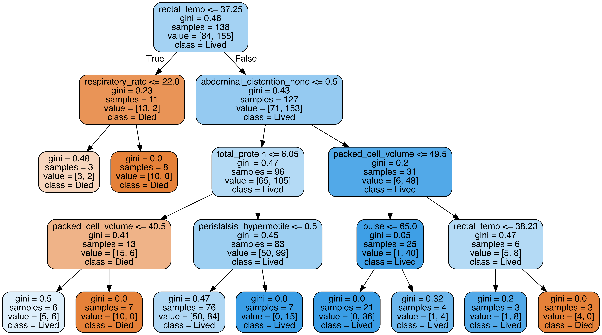
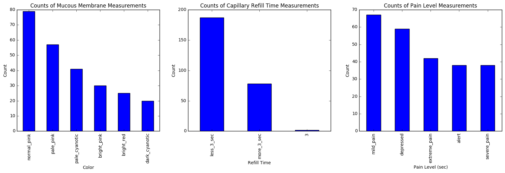

# Horse Colic Cases: What Does the Data Show?

**DISCLAIMER:** I am not a veterinarian! Merely a horse lover and machine learning enthusiast. PLEASE do not take any of the information presented in this blog post as veterinary advice, and ALWAYS consult with your veterinarian if you are concerned that your horse (or a horse under your care) may be experiencing colic. I am merely a data nerd with a passion for horses!

## What is Colic?

Colic is a condition of gastrointestinal upset or abdominal pain in horses. Colic is one of the worst nightmares of any horse owner. Symptoms of colic can include decreased appetite, little to no gut sounds, restlessness, obvious discomfort, pacing, rolling, and kicking at the abdomen. In more severe cases, horses can become violent in their movements or display more severe indications of distress, such as an elevated heart rate and respiratory rate, or other abnormal vital signs.

Colic can have a variety of causes, some of which are much more serious than others. For example: abdominal pain can be the result of gassiness, or "gas colic", which is rarely serious and usually resolves on its own. On the other hand, some types of colic, such as "torsion colic" (where the intestines are twisted, cutting off blood flow) can be very serious and require surgery to resolve.

Still other types, such as "impaction colic" (where the intestine of the horse is blocked by something, sometimes a foreign body) can go either way, depending on a variety of factors. It's important to remember that the owner cannot always know what type of colic a horse is experiencing, which is why it is important to consult a veterinarian who will likely collect a variety of health parameter measurements before making a recommendation for treatment.

In the most mild cases, colic can resolve on its own with or without medical attention. In more severe cases, colic can require invasive and expensive surgery to resolve, and this isn't always feasible or successful, especially in older or weaker horses. It is valuable to understand the signs of colic, particularly those which are associated with the most severe cases, and in relation to normal, healthy levels for a horse.

## What Can the Data Tell Us?

The Horse Colic Dataset, available from 
[the UC Irvine machine learning archives](https://archive.ics.uci.edu/ml/datasets/Horse+Colic), contains a variety of data for nearly 300 cases of horse colic, including cases which resolved with or without surgical intervention, and cases which resulted in death or euthanization. In cases where the horses did not survive, autopsies were performed to determine if the colic would have required surgery or not. 

Using a machine learning classification technique called "Random Forest Classification", which uses multiple "Decision Tree" classifiers under the hood, we can explore the data in this dataset to attempt to answer two questions of particular interest in any case of colic: Given the health parameters, is this horse likely to require surgery to recover? And: Given the health parameters, is this horse likely to survive? Finally, we can take a look at the ranges of some easily measured vital signs present in the data to get a feeling for how they compare to healthy levels.

## What Does the Data Tell Us?

For the first question we researched, the Random Forest Classifier was able to predict whether a horse would require surgery with ~70-80% accuracy. To get a feel for the features being used to make such a classification, one of the Decision Trees which makes up the Random Forest Classifier was graphically represented, and we can see that one of the strongest indicators that a horse would require surgery was the absence of normal feces:

This is certainly consistent with what a horse owner might expect! If the horse's digestive system is still able to effectively pass manure, the colic is not likely to be one of the more severe types of colic, such as an impaction or torsion colic, which are the types most likely to require surgery.

For the next question researched, another Random Forest Classifier was used, trained separately to be able to predict whether a horse would survive the colic with ~70-80% accuracy again. Once again, a visualization was used, and in this case we can see that rectal temperature was one of the most important predictive factors:

Once again, this jives with what an owner might expect, given that an elevated temperature could indicate complications on top of the colic which will not be resolved with medical treatment alone.

Finally, three of the most commonly measured health parameters by owners were plotted in order to visualize the ranges present in this dataset, for context:

## Why Do We Care?

Colic is a scary situation for any horse owner or horse professional! The more information we have about colic cases, the more armed we are with knowledge to help us take care of our beloved, four-legged friends. I hope you've enjoyed reading about my explorations of this dataset, and perhaps I've inspired you to take a data-driven approach to learning about something you are passionate about!
